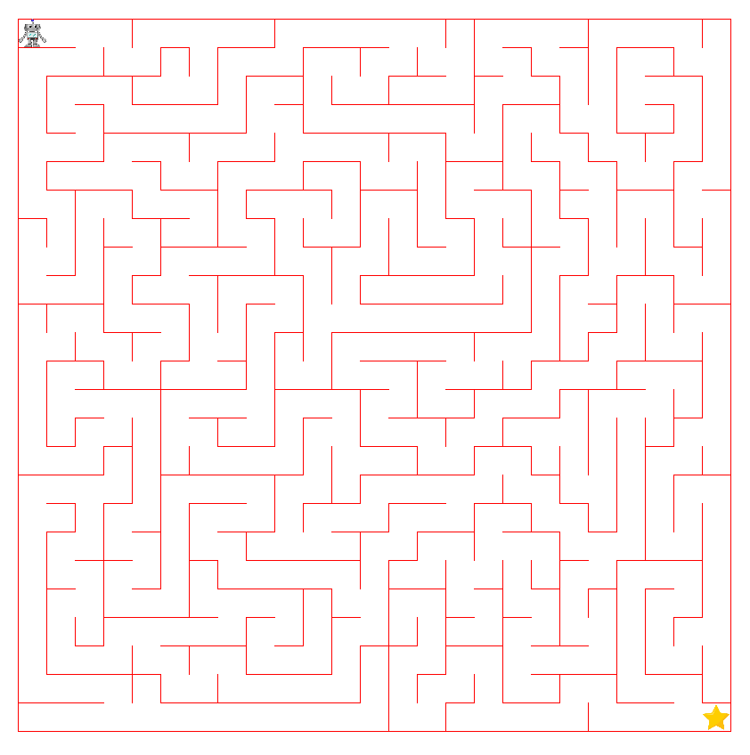

# MazeAI

Q-Learning algorithm which learns how to find its way to the star in a randomly generated maze.

## How to run?

Select one of the three modes, and the maze wil get generated. You can still edit the maze if you want by left-clicking on the cell you want to edit. Then right-click when you want to start the training. When the training is complete, right-click again and the robot will walk to the star.

## Modes

There are 3 modes, FullMode, QuickDrawMode and QuickMode.

### FullMode
This mode shows every progression with a sleep between frames so you can follow the progression. This one takes a lot of time!

### QuickDrawMode
This mode shows every progression without a sleep between frames.

### QuickMode
This mode is the quickest because it doesn't draw the learning fase. It should take less than a minute to learn a 30x30 maze

